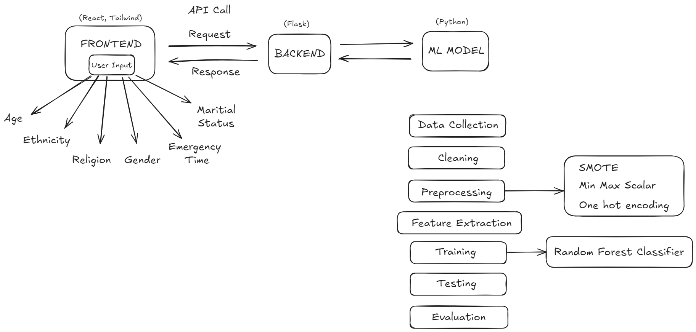

# हृदयAI - Heart Failure Readmission Prediction

## Overview

This project was developed for the Veersa Hackathon 2024, aimed at predicting the readmission of heart-failure patients within 30 days of discharge. By leveraging machine learning, we hope to identify at-risk patients, enabling targeted interventions to reduce morbidity, mortality, and financial burdens on healthcare systems.

## Problem Statement

Heart failure is a prevalent condition that can lead to fatalities if not addressed promptly. Even with proper treatment, hospital readmissions pose significant risks to patients' health and financial stability. The objective of this project is to develop a machine learning model to predict the likelihood of heart-failure patients being readmitted within 30 days of discharge.

## Project Goals

1. **Data Analysis**: Conduct a detailed analysis of the provided data to understand patterns and correlations.
2. **Model Development**: Build and train a machine learning model to predict readmission risk.
3. **Interface Design**: Create an intuitive interface to visualize predictions and insights.
4. **Testing and Validation**: Ensure the model's reliability through extensive testing.

## Deployment

Frontend: https://hridya-ai.vercel.app

Backend: https://hridyaai.onrender.com/predict [POST]

```json
{
    "religion": "PROTESTANT QUAKER",
    "marital_status": "MARRIED",
    "ethnicity": "BLACK/AFRICAN AMERICAN",
    "emergency_time": 10.0,
    "gender": "M",
    "age":40
}
```


## Data

We have used the MIMIC-III dataset for this project. The dataset contains tables with various attributes related to patient demographics, hospital stays, and clinical data. The following ICD-9 codes represent heart failure:

> '39891', '40201', '40211', '40291', '40401', '40403', '40411', '40413',
'40491', '40493', '4280', '4281', '42820', '42821', '42822', '42823',
'42830', '42831', '42832', '42833', '42840', '42841', '42842', '42843', '4289'


## Approach

1. **Data Selection**: Choose relevant tables and features that contribute to predicting readmissions.
2. **Data Cleaning and Preprocessing**: Handle missing values, normalize data, and encode categorical features.
3. **Model Training**: Experiment with various machine learning algorithms to find the most effective model.
4. **Evaluation**: Use metrics like accuracy, precision, recall, and F1-score to evaluate model performance.
5. **Deployment**: Deploy the model and interface on a public platform.

## Tools and Technologies

- **Programming Languages**: Python, JavaScript
- **Libraries/ Frameworks**: Pandas, NumPy, Scikit-learn, Flask, ReactJS, TailwindCSS
- **Design**: Figma, Excalidraw
- **Version Control**: GitHub
- **Deployment**: Vercel, Render

## Installation and Usage
1.**Clone the Repository**: 

```
git clone https://github.com/ShivanshAr97/HridyaAI
```

2.**Install Dependencies**:

```
pip install -r ml/requirements.txt
```

3.**Run the Server**: 
```
python ml/server.py
```

4.**Access the Interface**: 
```
cd frontend && npm run dev
```

## Testing
We have implemented both manual and automated testing procedures to ensure the accuracy and reliability of our model and software components.

**Manual Testing:**
Detailed test cases are documented.

**Automated Testing:** 
Unit tests are written using the unit test framework.

## Team

- [Shivansh Arora](https://github.com/shivanshar97)

- [Kshitiz Sharma](https://github.com/kshitiz11101)

- [Nilay Datta](https://github.com/nilaydatta1234)

- [Krrish Malhotra](https://github.com/ota0912)

## Submission:

The project is hosted on Vercel and includes all necessary components such as code, design files, and a short presentation video. Please find the link to our [GitHub Repository](https://github.com/ShivanshAr97/HridyaAI).

## Architechture and Design

- [Project Workflow](https://excalidraw.com/#json=GcJURuKrR7GKULACPi_HL,XjAlmsAjPuUFf-2s8kJ3nw)

- [Figma Design](https://www.figma.com/design/3aGOhbBEblEvr4HCy1m1LT/Veersa?node-id=0-1&t=uQiAmIdNgSciV4OT-1)

- [Canva Presentation](https://www.canva.com/design/DAGBlPKyO3M/xMkP2nAkGD7kRWcjwjnZeA/view?utm_content=DAGBlPKyO3M&utm_campaign=designshare&utm_medium=link&utm_source=editor)




## Future Scope
- Involve more complex parameters to enhance the accuracy of the model.
- Incorporate the model for other diagnosis like cancer, tumor, etc.
- Automate data collection from partnered hospitals to provide them a personalized utility tool.

## Video
[Video](/video.mp4)

For better quality (YouTube link): 
[](https://youtu.be/6970JcbFORQ)

